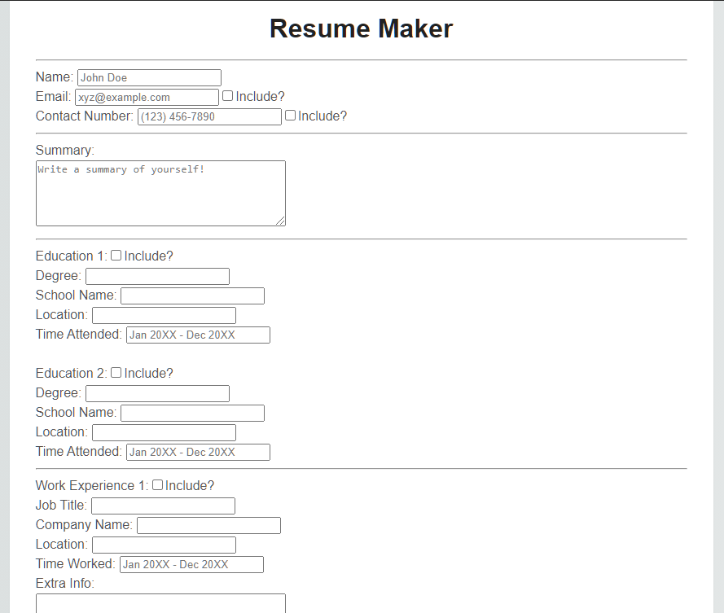
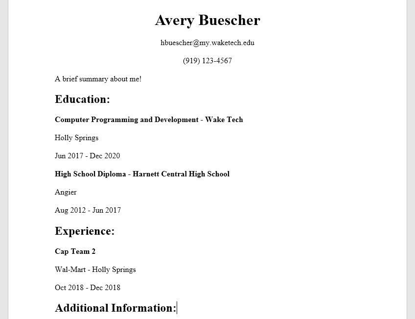
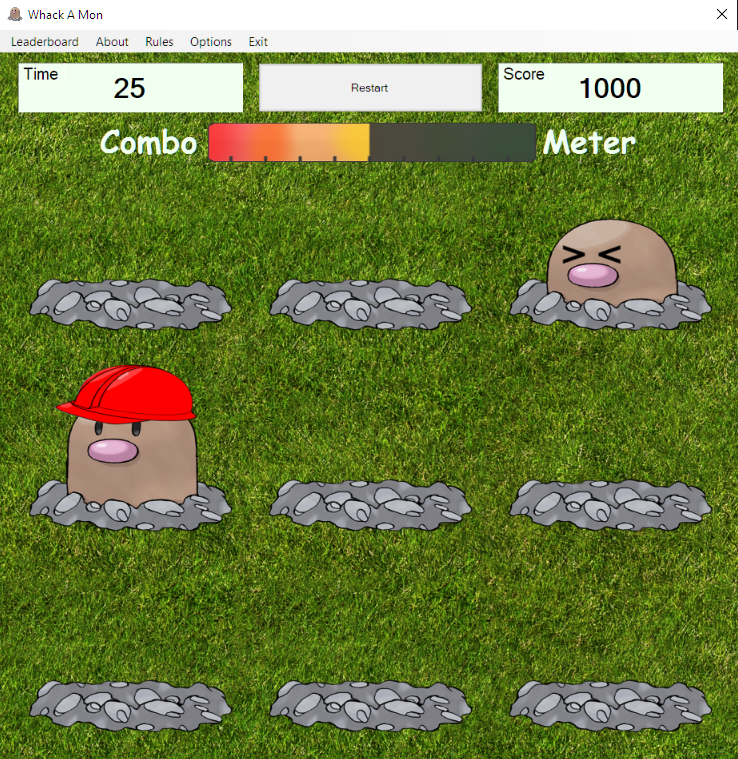

<h1>Simple Resume Builder</h1>

A simple website that prompts you for the basic information you'd need for a resume, 
which you can then download as a pre-formatted word document that you can personalize 
to suit your own needs!

[Azure Web Page](https://aresumebuilder.azurewebsites.net/)

<h1>Whack-A-Mon</h1>

A Pokemon themed whack-a-mole style game with trivia elements! Coded in VB.net, this 
high school project ended up competing in the Future Business Leaders of America National 
competition in 2017, and won 4th place at the national level in the game and simulation 
programming category!

